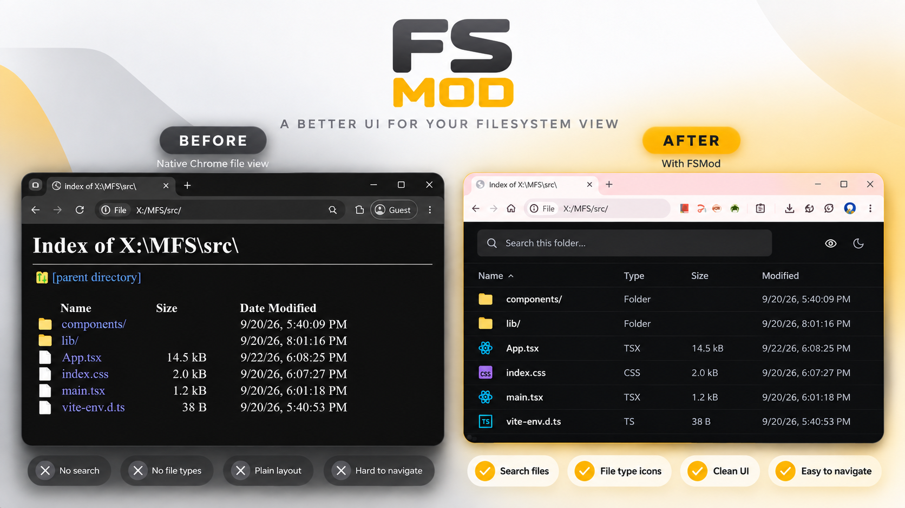

<div align="center">
  
<hr>
  <p><strong>A modern, aesthetic replacement for Chrome's native <code>file://</code> directory listing.</strong></p>
</div>



<br />

Chrome's default local file directory viewer is functional, but it feels like it hasn't been updated in decades. **FSMod** intercepts `file://` URLs in your browser and replaces them with a sleek, responsive, and highly functional React-based interface.

## Features

- **Modern UI:** Built with React, Tailwind CSS, and Lucide Icons for a beautiful, premium aesthetic.
- **Dark/Light Mode:** Full theme support with your preference saved locally.
- **Built-in File Previews:** Preview code, text, images, and PDFs directly in a resizable side pane without opening a new tab.
- **Smart History Management:** Viewing files in the preview pane intelligently remounts the viewer, preventing your browser's "Back" button history from getting bloated.
- **Resizable Columns:** Drag and adjust column widths, which are automatically saved across sessions.
- **Keyboard Shortcuts:** Built for speed with a dedicated preview toggle lock.

## Shortcuts

| Action                  | Shortcut        |
| ----------------------- | --------------- |
| **Open File/Folder**    | `Click`         |
| **Preview File**        | `Shift + Click` |
| **Toggle Preview Lock** | `Shift + P`     |

_(When Preview Lock is enabled, clicking any file will automatically open it in the preview pane instead of navigating away)._

## Installation

Since this modifies the native behavior of Chrome, it must be installed as an unpacked extension:

1. Clone or download this repository to your local machine.
2. Open Chrome and navigate to `chrome://extensions/`.
3. Enable **Developer mode** in the top right corner.
4. Click **Load unpacked** in the top left corner.
5. Select the `dist` folder generated after building the project.

### Development Setup

To modify and build the extension yourself:

```bash
# Install dependencies
npm install

# Run the development server
npm run dev

# Build the extension (outputs to /dist)
npm run build
```

## 🏗️ Technical Highlights

- **React & Vite:** Fast, modern development environment injecting an entire React app into the DOM via Chrome extension content scripts.
- **Tailwind CSS:** For highly customizable, utility-first styling.
- **Chrome Storage API / Local Storage:** Seamlessly persists UI state (theme, column widths, preview lock state) depending on the environment context.
- **Iframe Sandboxing:** Safely renders text, code, and PDF previews in isolated iframes.

---
